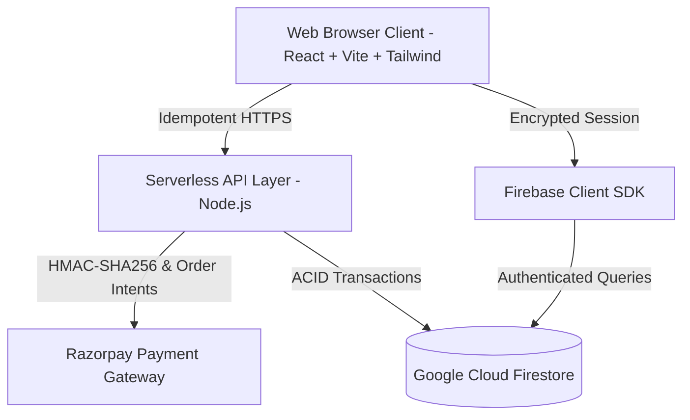

# VERNOX ARCHITECTURE SPECIFICATION

## 1. System Overview
Vernox is a luxury e-commerce platform and bespoke CAD/CAM architectural signage configurator engineered for high-concurrency, resilience, and cryptographic payment verification.

## 2. Technology Stack
- **Frontend Framework**: React 18 with TypeScript, Tailwind CSS, Lucide icons, and Sonner notifications.
- **CAD/CAM Vector Engine**: Custom in-browser computational geometry engine (`cadEngineTypes.ts`, `imageTracer.ts`, `manufacturingRules.ts`) enabling client-side kerf offset and DXF export.
- **Serverless API Layer**: Vercel Node.js Serverless Functions (`/api/checkout-intent`, `/api/create-order`, `/api/verify-payment`).
- **Database**: Google Cloud Firestore (multi-region distributed document store with document-level ACID transactions).
- **Authentication**: Firebase Authentication (Email/Password, Google OAuth, Phone SMS OTP) with role-based access control (RBAC).
- **Payment Gateway**: Razorpay with cryptographic HMAC-SHA256 signature verification and idempotent webhook/callback processing.

## 3. Server-Authoritative Domains
- **Pricing**: All calculations for catalog items, size deltas, finish surcharges, GST tax (18%), and shipping thresholds are calculated exclusively on the server (`api/pricingEngine.ts`). Client prices are display-only.
- **Inventory**: Authoritative inventory counts are persisted in Cloud Firestore. Stock decrements occur inside atomic transactions (`runTransaction`), completely preventing overselling during traffic spikes.
- **Order Lifecycle**:
  1. `Pending_Payment`: Initial state with a 15-minute reservation TTL and idempotency key.
  2. `Paid`: Cryptographically confirmed via HMAC-SHA256 against Razorpay.
  3. `Designing`: CAD/CAM files generated and verified.
  4. `Cutting`: Waterjet/fiber laser CNC cutting underway.
  5. `Finished`: Hand-patinated or brushed brass finish applied.
  6. `Shipped`: Carrier tracking assigned.
  7. `Delivered`: Final fulfillment verified.

## 4. Concurrency & High-Availability Architecture
- **Stateless App Tier**: No user session or cart data is held in local Node.js process memory. The app can scale horizontally across infinite serverless instances.
- **ACID Transactions**: Stock checks and decrements are bound inside Firestore transactions. If two concurrent users attempt to purchase the final unit of stock, the transaction detects the version mismatch and serializes the update; one succeeds, and the other is safely notified with an `INSUFFICIENT_STOCK` error.
